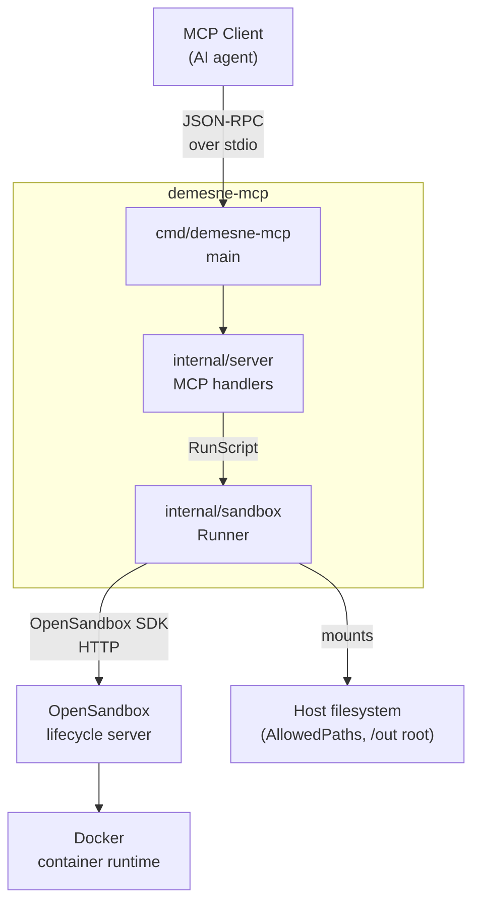
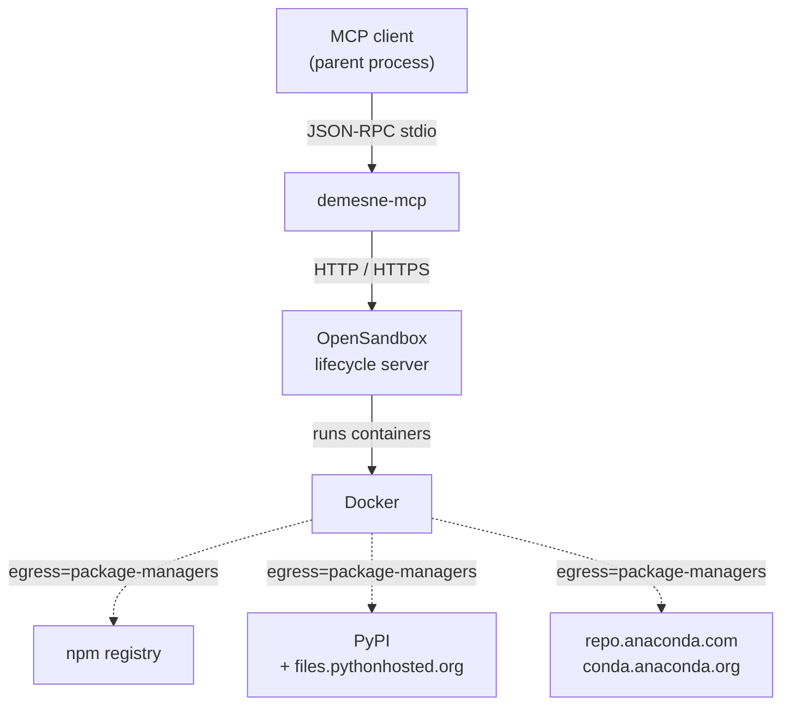
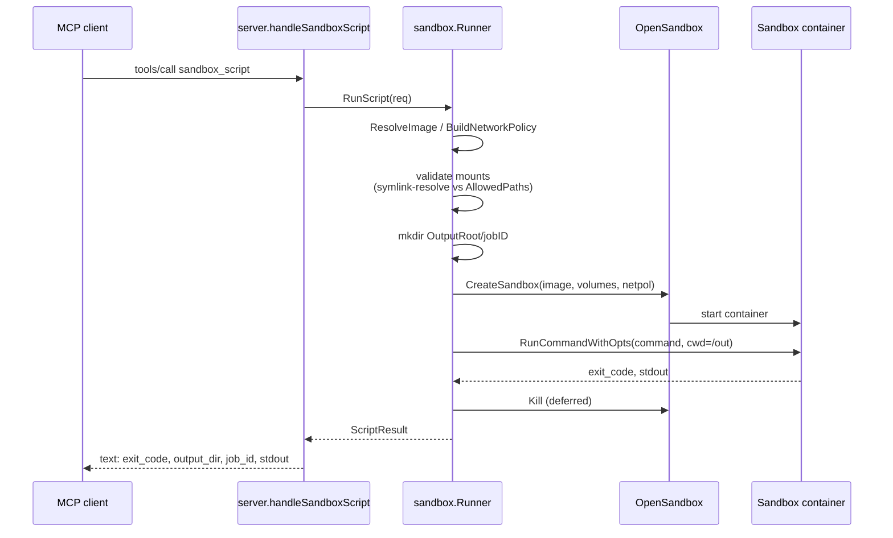

# Demesne

A Go [Model Context Protocol](https://modelcontextprotocol.io/) server that lets MCP-speaking AI agents run untrusted shell commands and scripts in disposable containers via [OpenSandbox](https://github.com/alibaba/OpenSandbox). Outbound network access is restricted by default and host paths are only exposed via an explicit allowlist.

## Status

Milestones 1 and 2 shipped: `sandbox_script` (single-shot), plus the persistent-sandbox lifecycle (`sandbox_create` / `exec` / `upload` / `download` / `destroy`). Future milestones will add a `sandbox_agent` runner for Claude Code inside a sandbox, a `sandbox_research` mode with unrestricted internet, and an MCP proxy for exposing host MCP servers inside sandboxes. See [ROADMAP.md](ROADMAP.md).

## Key concepts

- **MCP (Model Context Protocol)** — JSON-RPC over stdio. Demesne is a stdio-transport MCP server; an AI agent (the parent process) sends `tools/call` requests and reads results from stdout.
- **OpenSandbox** — Alibaba's container-based sandbox runtime. Demesne talks to a lifecycle server over HTTP using their Go SDK.
- **Sandbox** — a container instance. `sandbox_script` creates one, runs a command, kills it. `sandbox_create` returns a long-lived handle; commands run against it via `sandbox_exec` until `sandbox_destroy`. Persistent sandboxes have a 24h TTL that's refreshed by each `sandbox_exec` call.
- **Image whitelist** — three accepted names: `node` (`node:22`), `python` (`python:3.12`), and `anaconda` (`continuumio/anaconda3:latest`, the default).
- **Egress modes** — `none` denies all outbound; `package-managers` (default) denies by default and allows registry.npmjs.org, pypi.org, files.pythonhosted.org, repo.anaconda.com, and conda.anaconda.org. Image and egress are fixed at create time.
- **Mounts** — caller-supplied host files and directories are mounted **read-only** at `/in/<basename>`. A writable `/out` mount is provisioned automatically; its host path is returned so the caller can read produced artifacts. `sandbox_upload` and `sandbox_download` move individual files in and out at runtime via the SDK (not through `/out`).
- **AllowedPaths** — env-configured whitelist (`DEMESNE_ALLOWED_PATHS`) of host paths under which inputs may be mounted or uploaded. Both the candidate path and the allowlist entries are symlink-resolved before the containment check, so symlink escapes are rejected.
- **Sandbox ID** — handle returned by `sandbox_create` (the OpenSandbox-issued UUID). Passed to `sandbox_exec` / `sandbox_upload` / `sandbox_download` / `sandbox_destroy`. The host output directory for a persistent sandbox is returned as `output_dir` in the create response; treat it as opaque.

## Architecture



`cmd/demesne-mcp` loads configuration from the environment, builds a `sandbox.Runner`, and serves MCP over stdio. `internal/server` registers the `sandbox_script` tool and parses arguments, then delegates to the runner. `internal/sandbox` validates mounts, resolves images, builds the network policy, creates the sandbox via the OpenSandbox SDK, runs the command, and tears the sandbox down.

## Dependencies



External services in play:

- **MCP client (parent process)** — speaks JSON-RPC to demesne via stdin/stdout.
- **OpenSandbox lifecycle server** — HTTP/HTTPS, configured via `OPEN_SANDBOX_DOMAIN` / `OPEN_SANDBOX_PROTOCOL` / `OPEN_SANDBOX_API_KEY`.
- **Docker** — driven by OpenSandbox to run the container.
- **Package registries** (npm, PyPI, Anaconda) — only reachable from the sandbox when `egress=package-managers`.

Direct Go dependencies: [`github.com/mark3labs/mcp-go`](https://github.com/mark3labs/mcp-go) for the MCP framework, [`github.com/alibaba/OpenSandbox/sdks/sandbox/go`](https://github.com/alibaba/OpenSandbox) for the sandbox lifecycle SDK, and [`github.com/google/uuid`](https://github.com/google/uuid) for job IDs.

## Data flow



The deferred `Kill` runs against a fresh `context.Background()` with a 30-second timeout, so the sandbox is torn down even if the request context was cancelled. Commands run with `cwd=/out` and a 12-hour timeout so long-running data jobs aren't capped artificially.

## Tools

| Tool               | Description                                                                                                                                                                                                                                |
|--------------------|--------------------------------------------------------------------------------------------------------------------------------------------------------------------------------------------------------------------------------------------|
| `sandbox_script`   | Run a shell command in a fresh sandbox and tear it down. Returns exit code, stdout, and the `/out` host path.                                                                                                                              |
| `sandbox_create`   | Create a persistent sandbox. Returns a `sandbox_id` handle and the `/out` host path. TTL is 24h, refreshed by each `sandbox_exec`.                                                                                                          |
| `sandbox_exec`     | Run a shell command in an existing sandbox. Refreshes TTL. Returns exit code and stdout.                                                                                                                                                    |
| `sandbox_upload`   | Copy a host file into an existing sandbox.                                                                                                                                                                                                  |
| `sandbox_download` | Copy a file out of an existing sandbox; written under `<output_dir>/downloads/<basename>`. Returns the host path.                                                                                                                           |
| `sandbox_destroy`  | Kill an existing sandbox. Host output dir is preserved.                                                                                                                                                                                     |

### `sandbox_script` parameters

| Name          | Type             | Required | Default            | Description                                                                                                       |
|---------------|------------------|----------|--------------------|-------------------------------------------------------------------------------------------------------------------|
| `command`     | string           | yes      |                    | Shell command run inside the sandbox. Working directory is `/out`.                                                |
| `image`       | string           | no       | `anaconda`         | One of `node` (`node:22`), `python` (`python:3.12`), or `anaconda` (`continuumio/anaconda3:latest`).              |
| `egress`      | string           | no       | `package-managers` | `package-managers` allows npm/PyPI/conda registries; `none` denies all egress.                                    |
| `files`       | array of strings | no       | `[]`               | Host file paths to mount read-only at `/in/<basename>`. Each must be absolute and inside `DEMESNE_ALLOWED_PATHS`. |
| `directories` | array of strings | no       | `[]`               | Host directory paths to mount read-only at `/in/<basename>`. Same containment rule as `files`.                    |

The result text contains the exit code, the host path of the `/out` mount, the job ID, and captured stdout.

### `sandbox_create` parameters

Same as `sandbox_script` minus `command`. Returns `sandbox_id` and `output_dir`.

| Name          | Type             | Required | Default            | Description                                                                                                        |
|---------------|------------------|----------|--------------------|--------------------------------------------------------------------------------------------------------------------|
| `image`       | string           | no       | `anaconda`         | One of `node`, `python`, or `anaconda`.                                                                            |
| `egress`      | string           | no       | `package-managers` | `package-managers` allows npm/PyPI/conda registries; `none` denies all egress.                                     |
| `files`       | array of strings | no       | `[]`               | Host file paths mounted read-only at `/in/<basename>`. Each must be inside `DEMESNE_ALLOWED_PATHS`.                |
| `directories` | array of strings | no       | `[]`               | Host directory paths mounted read-only at `/in/<basename>`. Same containment rule.                                 |

### `sandbox_exec` parameters

| Name         | Type   | Required | Description                                                                                              |
|--------------|--------|----------|----------------------------------------------------------------------------------------------------------|
| `sandbox_id` | string | yes      | Handle returned by `sandbox_create`.                                                                     |
| `command`    | string | yes      | Shell command run inside the sandbox. Working directory is `/out`. TTL is refreshed by 24h before exec.  |

### `sandbox_upload` parameters

| Name         | Type   | Required | Description                                                                                  |
|--------------|--------|----------|----------------------------------------------------------------------------------------------|
| `sandbox_id` | string | yes      | Handle returned by `sandbox_create`.                                                         |
| `src`        | string | yes      | Absolute host file path. Must be a regular file and inside `DEMESNE_ALLOWED_PATHS`.         |
| `dst`        | string | yes      | Absolute path inside the sandbox. Its parent directory must already exist.                   |

### `sandbox_download` parameters

| Name         | Type   | Required | Description                                                                                                 |
|--------------|--------|----------|-------------------------------------------------------------------------------------------------------------|
| `sandbox_id` | string | yes      | Handle returned by `sandbox_create`.                                                                        |
| `src`        | string | yes      | Absolute path inside the sandbox. The file is written under `<output_dir>/downloads/<basename(src)>`.       |

### `sandbox_destroy` parameters

| Name         | Type   | Required | Description                                                                              |
|--------------|--------|----------|------------------------------------------------------------------------------------------|
| `sandbox_id` | string | yes      | Handle returned by `sandbox_create`. The host output directory is preserved.             |

### Persistent sandbox lifecycle

A typical persistent-sandbox session looks like:

1. `sandbox_create(image="python", egress="package-managers")` → returns `sandbox_id` and `output_dir`.
2. `sandbox_exec(sandbox_id, "pip install pandas")` — installs into the long-lived container.
3. `sandbox_upload(sandbox_id, src="/host/data.csv", dst="/data.csv")` — ships an input.
4. `sandbox_exec(sandbox_id, "python -c '...'")` — runs analysis; artefacts go to `/out`.
5. `sandbox_download(sandbox_id, src="/results.json")` — pulls a specific artefact back.
6. `sandbox_destroy(sandbox_id)` — explicit teardown. The host `output_dir` is left in place.

## Configuration

| Environment variable      | Required | Default               | Description                                                                                                       |
|---------------------------|----------|-----------------------|-------------------------------------------------------------------------------------------------------------------|
| `DEMESNE_ALLOWED_PATHS`  | yes      |                       | Colon-separated list of host paths under which tools may mount files/directories or upload from. Anything outside is rejected. Symlinks are resolved before the containment check. |
| `DEMESNE_OUTPUT_ROOT`    | no       | `/tmp/demesne/out`   | Host directory under which per-job `/out` mounts are created.                                                     |
| `OPEN_SANDBOX_DOMAIN`     | yes      |                       | Host:port of the OpenSandbox lifecycle server (e.g. `localhost:8080`).                                            |
| `OPEN_SANDBOX_PROTOCOL`   | no       | `http`                | `http` or `https`.                                                                                                |
| `OPEN_SANDBOX_API_KEY`    | yes      |                       | API key for the OpenSandbox lifecycle server.                                                                     |

## Run a local OpenSandbox

The reference OpenSandbox server runs locally against Docker:

```
pipx install uv
uvx opensandbox-server init-config ~/.sandbox.toml --example docker
uvx opensandbox-server --config ~/.sandbox.toml
```

Feed the lifecycle host:port and API key to Demesne via `OPEN_SANDBOX_DOMAIN`
and `OPEN_SANDBOX_API_KEY`.

### Required `~/.sandbox.toml` edits

The packaged docker example defaults are too permissive for use as a security
boundary. Change two settings before starting the server:

- **`[egress] mode = "dns+nft"`** (default is `"dns"`). The default only
  filters egress at DNS lookup; raw-IP outbound traffic still succeeds, so
  `egress: "none"` in `sandbox_script` does not actually deny network. The
  `dns+nft` mode adds nftables-based IP filtering and makes `none` mean
  none.
- **`[server] api_key = "<some-secret>"`** (default is empty). With an empty
  key, the server requires either an interactive `YES` at startup or
  `OPENSANDBOX_INSECURE_SERVER=YES` in the environment.
- **`[storage] allowed_host_paths = ["/tmp", "/home/<you>/code"]`** (or
  whichever directories you want bind-mountable). The example sets `[]`
  with a comment saying "all paths allowed", but empirically empty means
  *nothing* is allowed — every bind mount fails with
  `VOLUME::HOST_PATH_NOT_ALLOWED`. Both OpenSandbox's allowlist and
  demesne's `DEMESNE_ALLOWED_PATHS` must include each host path you
  intend to mount.

## Build and run

```
make build
DEMESNE_ALLOWED_PATHS=/tmp/demesne-test \
  OPEN_SANDBOX_DOMAIN=localhost:8080 \
  OPEN_SANDBOX_API_KEY=... \
  ./bin/demesne-mcp
```

The binary speaks JSON-RPC over stdio. Wire it into Claude Code's MCP config (or any MCP client) to invoke `sandbox_script`.

## Validation

```
make lint
make test-short
make build
```

Integration tests in `internal/sandbox/runner_integration_test.go` drive
a real OpenSandbox end-to-end. They live behind the `integration` build
tag, so the default test path doesn't touch them. To run them:

```
make setup-files     # one-off: copies .env.dist to .env
$EDITOR .env         # fill in OPEN_SANDBOX_API_KEY
make test-integration
```

`make setup-tools` installs the `godotenv` CLI that `test-integration`
uses to load `.env`.

The integration suite covers: the `/out` mount round-trip; `egress: "none"`
blocks both DNS and raw-IP egress; `egress: "package-managers"` allows
pypi.org; the full persistent-sandbox lifecycle
(create / exec / upload / exec / download / destroy); and that
`sandbox_exec` refreshes the sandbox TTL. The raw-IP assertion requires
the `[egress] mode = "dns+nft"` config noted above; against a
`mode = "dns"` server it will fail.
