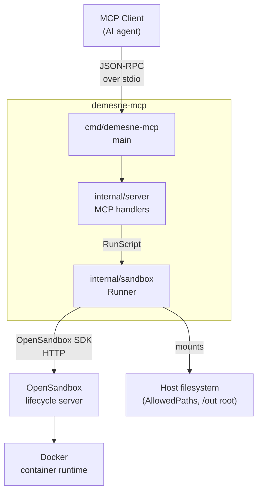
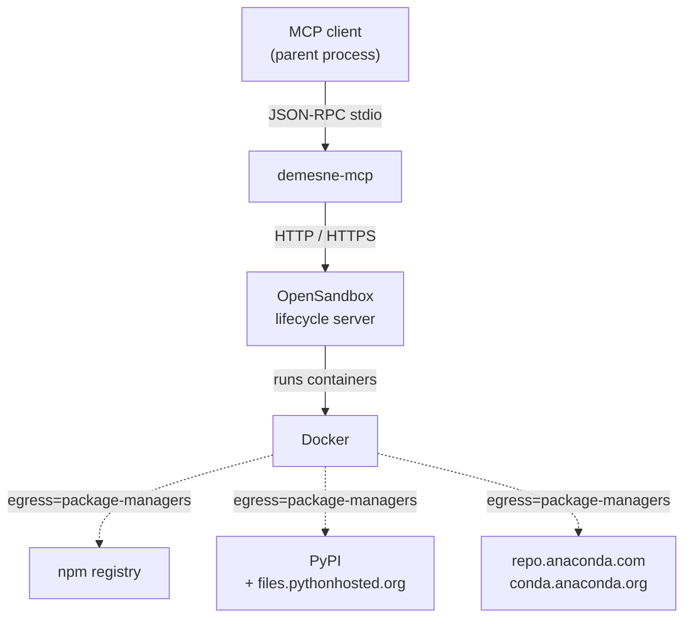
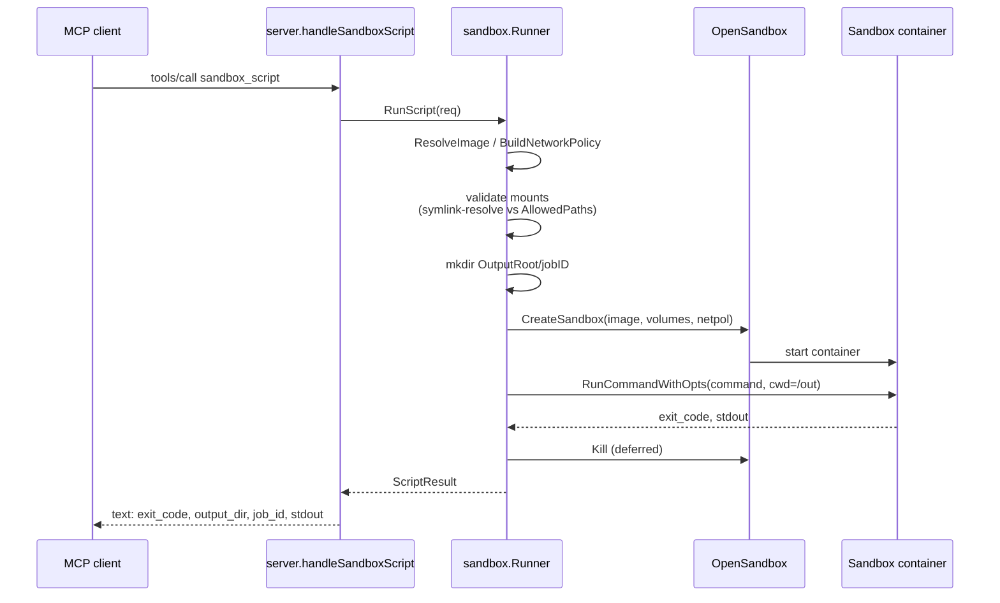
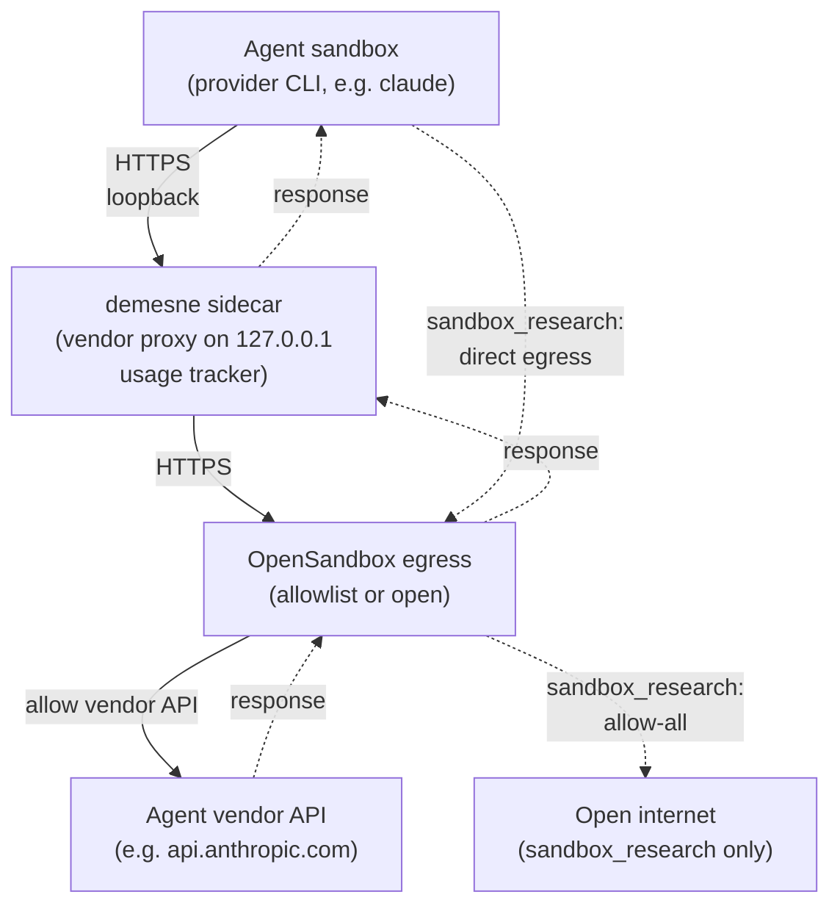
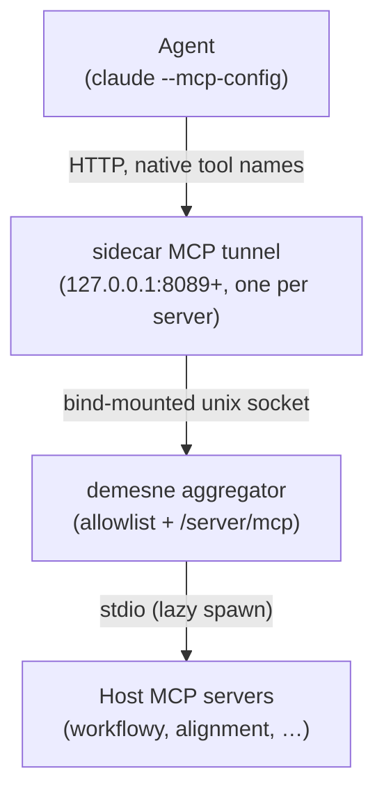
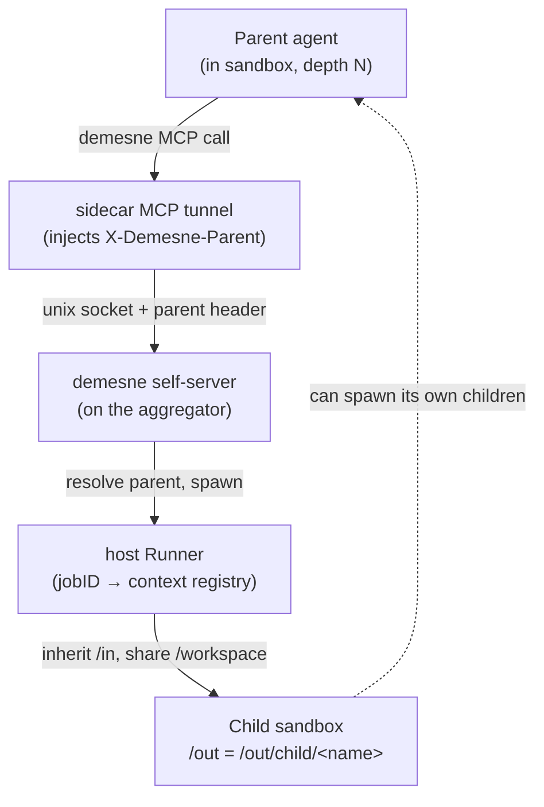

# Demesne

A Go [Model Context Protocol](https://modelcontextprotocol.io/) server that lets MCP-speaking AI agents run untrusted shell commands and scripts in disposable containers via [OpenSandbox](https://github.com/alibaba/OpenSandbox). Outbound network access is restricted by default and host paths are only exposed via an explicit allowlist.

## Status

Milestones 1–6 shipped: `sandbox_script` (single-shot), the persistent-sandbox lifecycle (`sandbox_create` / `exec` / `upload` / `download` / `destroy`), `sandbox_agent` — an AI coding agent (currently the Claude Code CLI) in a fresh sandbox with outbound HTTPS funnelled through a host-side per-vendor API proxy, and `sandbox_research` — a long-running research variant with no input mounts and unrestricted outbound internet. The proxy parses each agent-model API response for usage events and writes `usage.json` to the run's `/out` directory; the reported `cost_usd` is indicative. M5 added the **host MCP proxy**: demesne re-exposes a curated, read-only subset of the stdio MCP servers in your Claude Code config to sandboxed agents, reached through a per-sandbox tunnel under their native tool names. M6 added **child sandboxes**: demesne re-exposes its *own* tools to agents as an in-process `demesne` MCP server on that same proxy, so an agent can spawn child sandboxes that inherit its inputs and shared `/workspace` and nest their output under `/out/child/<name>`; a per-job `results.json` rolls up the tree's cost. See [ROADMAP.md](ROADMAP.md).

## Key concepts

- **MCP (Model Context Protocol)** — JSON-RPC over stdio. Demesne is a stdio-transport MCP server; an AI agent (the parent process) sends `tools/call` requests and reads results from stdout.
- **OpenSandbox** — Alibaba's container-based sandbox runtime. Demesne talks to a lifecycle server over HTTP using their Go SDK.
- **Sandbox** — a container instance. `sandbox_script` creates one, runs a command, kills it. `sandbox_create` returns a long-lived handle; commands run against it via `sandbox_exec` until `sandbox_destroy`. Persistent sandboxes have a 24h TTL that's refreshed by each `sandbox_exec` call.
- **Image whitelist** — four accepted names for shell tools: `node` (`node:22`), `python` (`python:3.12`), `go` (`golang:1`, batteries-included with the Go toolchain + git + gcc + make), and `anaconda` (`continuumio/anaconda3:latest`, the default). `sandbox_agent` and `sandbox_research` use the agent provider's own image, built locally from an embedded Dockerfile (today: `demesne-claude-code:<hash>` for the claude-code provider).
- **Egress modes** — `none` denies all outbound; `package-managers` (default for `sandbox_script` / `sandbox_create`) allows registry.npmjs.org, pypi.org, files.pythonhosted.org, repo.anaconda.com, and conda.anaconda.org; `open` allows everything and is only reachable through `sandbox_research`. `sandbox_agent` rejects `open` — combining read-only `/in` mounts with unrestricted outbound is the data-exfiltration shape the surface keeps off. Image and egress are fixed at create time.
- **Mounts** — caller-supplied host files and directories are mounted **read-only** at `/in/<basename>`. A writable `/out` mount is provisioned automatically; its host path is returned so the caller can read produced artifacts. `sandbox_agent` adds a writable `/workspace` mount and runs the agent from a private subdirectory of it; the generated context file (`CLAUDE.md` for claude-code) and MCP config are mounted read-only under `/in/.agent` (kept off `/workspace` so sibling/child agents sharing the mount can't clobber each other's control files). `sandbox_research` is the same but never has any other `/in/<basename>` mounts. `sandbox_upload` and `sandbox_download` move individual files in and out at runtime via the SDK (not through `/out`).
- **Child sandboxes** — for `sandbox_agent` and `sandbox_research`, demesne re-exposes its own tools to the agent as an in-process `demesne` MCP server mounted on the host MCP proxy (so it rides the same per-sandbox tunnel). The agent can spawn child sandboxes (`sandbox_script` / `agent` / `research` / `create` / `exec` / `destroy`; no `upload`/`download`). `sandbox_agent` children take no mount params: they inherit the parent's read-only `/in` and shared writable `/workspace`, and their `/out` is `/out/child/<name>` (visible to the parent and ancestors; descendants nest deeper). `sandbox_research` children are the exception: they get a fresh private workspace with no `/in` mounts. Names are required and unique per parent. Identity is conveyed by a trusted header the sidecar tunnel injects (the agent can't forge it), so there's no auth — consistent with the sandbox-edge trust boundary. There is no recursion depth cap. Each agent run also writes `<out>/results.json` with `own_usage_usd` and a `total_usage_usd` that sums the whole descendant tree.
- **Per-sandbox proxy sidecar** — every sandbox gets a sidecar container that joins OpenSandbox's egress-sidecar network namespace and runs demesne's proxies on `127.0.0.1`. The **Go module proxy** (port `8087`, set as `GOPROXY` in the sandbox) runs in every sandbox, forwarding to `proxy.golang.org` (including the `/sumdb/` checksum endpoint). `sandbox_agent` / `sandbox_research` additionally run the **Anthropic API proxy** (`8088`) and the **MCP tunnel** (`8089+`). Each proxy bypasses OpenSandbox's egress filter via `SO_MARK` (the sidecar has `CAP_NET_ADMIN`; the sandbox does not), so the sandbox reaches those upstreams *only* through the proxies — Go module downloads resolve even under `egress=none` without `proxy.golang.org` in the allowlist. The Go checksum database (`sum.golang.org`) is the exception: `go` contacts it directly, so it's the one host demesne adds to every sandbox's egress allowlist (keeping module verification on). The real OAuth token transits the Anthropic proxy unchanged.
- **Indicative cost reporting** — the sandbox's vendor proxy parses upstream API responses for `usage` blocks (both streaming SSE and JSON bodies), accumulates token counts per model family, and computes USD cost from an embedded pricing table. Snapshots are rewritten atomically to `usage.json` after every request and surfaced in the MCP response as `cost_usd`. The value is **indicative** — for example, Claude Code OAuth tokens typically authorise against a Claude Console subscription rather than per-request API billing, so the figure is useful for budgeting but not what the user is actually charged.
- **Host MCP tools** — for `sandbox_agent` and `sandbox_research`, demesne can re-expose the stdio MCP servers already configured in your Claude Code config (`~/.claude.json`). At startup demesne discovers those servers, spawns them lazily on demand, and serves one HTTP MCP endpoint per server on host loopback (the in-process *aggregator*). Each sandbox's sidecar runs one tunnel listener per server (ports `8089`, `8090`, …) sharing a single outbound connection to the host. The agent sees each server in its own `--mcp-config` entry under the upstream's **native tool names** (no synthetic prefix). Only tools on the read-only allowlist are ever exposed — `tools/list` itself is filtered at the aggregator. There is no auth between the agent, the tunnel, and the aggregator: the sandbox edge is the trust boundary, and the aggregator listens only on a host-reachable interface. The allowlist is built-in read-only defaults per known server, overridable per-server via a JSON file (auto-seeded at `~/.config/demesne/mcp-allowlist.json`).
- **AllowedPaths** — env-configured whitelist (`DEMESNE_ALLOWED_PATHS`) of host paths under which inputs may be mounted or uploaded. Both the candidate path and the allowlist entries are symlink-resolved before the containment check, so symlink escapes are rejected.
- **Sandbox ID** — handle returned by `sandbox_create` (the OpenSandbox-issued UUID). Passed to `sandbox_exec` / `sandbox_upload` / `sandbox_download` / `sandbox_destroy`. The host output directory for a persistent sandbox is returned as `output_dir` in the create response; treat it as opaque.

## Architecture



`cmd/demesne-mcp` loads configuration from the environment, builds a `sandbox.Runner`, and serves MCP over stdio. `internal/server` registers the `sandbox_script` tool and parses arguments, then delegates to the runner. `internal/sandbox` validates mounts, resolves images, builds the network policy, creates the sandbox via the OpenSandbox SDK, runs the command, and tears the sandbox down.

## Dependencies



External services in play:

- **MCP client (parent process)** — speaks JSON-RPC to demesne via stdin/stdout.
- **OpenSandbox lifecycle server** — HTTP/HTTPS, configured via `OPEN_SANDBOX_DOMAIN` / `OPEN_SANDBOX_PROTOCOL` / `OPEN_SANDBOX_API_KEY`.
- **Docker** — driven by OpenSandbox to run the container.
- **Package registries** (npm, PyPI, Anaconda) — only reachable from the sandbox when `egress=package-managers`.

Direct Go dependencies: [`github.com/mark3labs/mcp-go`](https://github.com/mark3labs/mcp-go) for the MCP framework, [`github.com/alibaba/OpenSandbox/sdks/sandbox/go`](https://github.com/alibaba/OpenSandbox) for the sandbox lifecycle SDK, and [`github.com/google/uuid`](https://github.com/google/uuid) for job IDs.

## Data flow



The deferred `Kill` runs against a fresh `context.Background()` with a 30-second timeout, so the sandbox is torn down even if the request context was cancelled. Commands run with `cwd=/out` and a 12-hour timeout so long-running data jobs aren't capped artificially.

## Tools

| Tool               | Description                                                                                                                                                                                                                                |
|--------------------|--------------------------------------------------------------------------------------------------------------------------------------------------------------------------------------------------------------------------------------------|
| `sandbox_script`   | Run a shell command in a fresh sandbox and tear it down. Returns exit code, stdout, and the `/out` host path.                                                                                                                              |
| `sandbox_create`   | Create a persistent sandbox. Returns a `sandbox_id` handle and the `/out` host path. TTL is 24h, refreshed by each `sandbox_exec`.                                                                                                          |
| `sandbox_exec`     | Run a shell command in an existing sandbox. Refreshes TTL. Returns exit code and stdout.                                                                                                                                                    |
| `sandbox_upload`   | Copy a host file into an existing sandbox.                                                                                                                                                                                                  |
| `sandbox_download` | Copy a file out of an existing sandbox; written under `<output_dir>/downloads/<basename>`. Returns the host path.                                                                                                                           |
| `sandbox_destroy`  | Kill an existing sandbox. Host output dir is preserved.                                                                                                                                                                                     |
| `sandbox_agent`    | Run an AI coding agent (currently the Claude Code CLI) in a fresh sandbox against a caller-supplied prompt. Outbound HTTPS is restricted to the per-vendor API proxy. Returns exit code, stdout, the `/out` host path, and the (indicative) cost summary.                       |
| `sandbox_research` | Run a long-running research agent with no input mounts and unrestricted outbound internet. Returns exit code, stdout, the `/out` host path, and the (indicative) cost summary.                                                              |

### `sandbox_script` parameters

| Name          | Type             | Required | Default            | Description                                                                                                       |
|---------------|------------------|----------|--------------------|-------------------------------------------------------------------------------------------------------------------|
| `command`     | string           | yes      |                    | Shell command run inside the sandbox. Working directory is `/out`.                                                |
| `image`       | string           | no       | `anaconda`         | One of `node` (`node:22`), `python` (`python:3.12`), `go` (`golang:1`), or `anaconda` (`continuumio/anaconda3:latest`).              |
| `egress`      | string           | no       | `package-managers` | `package-managers` allows npm/PyPI/conda registries; `none` denies all egress.                                    |
| `files`       | array of strings | no       | `[]`               | Host file paths to mount read-only at `/in/<basename>`. Each must be absolute and inside `DEMESNE_ALLOWED_PATHS`. |
| `directories` | array of strings | no       | `[]`               | Host directory paths to mount read-only at `/in/<basename>`. Same containment rule as `files`.                    |

The result text contains the exit code, the host path of the `/out` mount, the job ID, and captured stdout.

### `sandbox_create` parameters

Same as `sandbox_script` minus `command`. Returns `sandbox_id` and `output_dir`.

| Name          | Type             | Required | Default            | Description                                                                                                        |
|---------------|------------------|----------|--------------------|--------------------------------------------------------------------------------------------------------------------|
| `image`       | string           | no       | `anaconda`         | One of `node`, `python`, `go`, or `anaconda`.                                                                      |
| `egress`      | string           | no       | `package-managers` | `package-managers` allows npm/PyPI/conda registries; `none` denies all egress.                                     |
| `files`       | array of strings | no       | `[]`               | Host file paths mounted read-only at `/in/<basename>`. Each must be inside `DEMESNE_ALLOWED_PATHS`.                |
| `directories` | array of strings | no       | `[]`               | Host directory paths mounted read-only at `/in/<basename>`. Same containment rule.                                 |

### `sandbox_exec` parameters

| Name         | Type   | Required | Description                                                                                              |
|--------------|--------|----------|----------------------------------------------------------------------------------------------------------|
| `sandbox_id` | string | yes      | Handle returned by `sandbox_create`.                                                                     |
| `command`    | string | yes      | Shell command run inside the sandbox. Working directory is `/out`. TTL is refreshed by 24h before exec.  |

### `sandbox_upload` parameters

| Name         | Type   | Required | Description                                                                                  |
|--------------|--------|----------|----------------------------------------------------------------------------------------------|
| `sandbox_id` | string | yes      | Handle returned by `sandbox_create`.                                                         |
| `src`        | string | yes      | Absolute host file path. Must be a regular file and inside `DEMESNE_ALLOWED_PATHS`.         |
| `dst`        | string | yes      | Absolute path inside the sandbox. Its parent directory must already exist.                   |

### `sandbox_download` parameters

| Name         | Type   | Required | Description                                                                                                 |
|--------------|--------|----------|-------------------------------------------------------------------------------------------------------------|
| `sandbox_id` | string | yes      | Handle returned by `sandbox_create`.                                                                        |
| `src`        | string | yes      | Absolute path inside the sandbox. The file is written under `<output_dir>/downloads/<basename(src)>`.       |

### `sandbox_destroy` parameters

| Name         | Type   | Required | Description                                                                              |
|--------------|--------|----------|------------------------------------------------------------------------------------------|
| `sandbox_id` | string | yes      | Handle returned by `sandbox_create`. The host output directory is preserved.             |

### `sandbox_agent` parameters

| Name           | Type             | Required | Default       | Description                                                                                                                          |
|----------------|------------------|----------|---------------|--------------------------------------------------------------------------------------------------------------------------------------|
| `prompt`       | string           | yes      |               | Task description handed to the agent. Becomes the `## Task` section of the generated context file.                                    |
| `agent`        | string           | no       | `claude-code` | Agent provider to run. Only `claude-code` is registered today.                                                                       |
| `model`        | string           | no       | `sonnet`      | One of `opus`, `sonnet`, or `haiku`. Provider-specific (claude-code).                                                                 |
| `preamble`     | string           | no       |               | Free-form prose prepended verbatim to the generated agent context file (e.g. `/in/CLAUDE.md` for claude-code) before the auto-generated environment section. |
| `files`        | array of strings | no       | `[]`          | Host file paths mounted read-only at `/in/<basename>`. Each must be inside `DEMESNE_ALLOWED_PATHS`.                                  |
| `directories`  | array of strings | no       | `[]`          | Host directory paths mounted read-only at `/in/<basename>`. Same containment rule.                                                   |
| `egress`       | string           | no       | `none`        | `none` allows only the per-vendor API proxy; `package-managers` also opens npm/PyPI/conda registries; `open` is **refused** here — use `sandbox_research`. |

The agent runs in a fresh container with cwd `/workspace`. The result text contains the exit code, the host path of the `/out` mount, the job ID, the indicative `cost_usd`, the `total_usage_usd` (this run plus every descendant sandbox), and the agent's stdout. Structured `usage.json` and `results.json` files are also written into the `/out` directory. `cost_usd` is indicative — see *Indicative cost reporting* under Key concepts.

### `sandbox_research` parameters

| Name           | Type   | Required | Default       | Description                                                                                                          |
|----------------|--------|----------|---------------|----------------------------------------------------------------------------------------------------------------------|
| `prompt`       | string | yes      |               | Task description. Becomes the `## Task` section of the generated agent context file.                                  |
| `agent`        | string | no       | `claude-code` | Agent provider to run. Only `claude-code` is registered today.                                                       |
| `model`        | string | no       | `sonnet`      | One of `opus`, `sonnet`, or `haiku`. Provider-specific (claude-code).                                                 |
| `preamble`     | string | no       |               | Free-form prose prepended verbatim to the generated agent context file (e.g. `/in/CLAUDE.md` for claude-code) before the auto-generated environment section. |

Egress is always `open`; there is no caller-visible egress knob, no `files`, and no `directories`. The combination of read-only inputs + open egress is not exposed (use `sandbox_agent` for inputs, or `sandbox_research` for open egress — never both). The result text and on-disk `usage.json` mirror `sandbox_agent`'s.


A typical persistent-sandbox session looks like:

1. `sandbox_create(image="python", egress="package-managers")` → returns `sandbox_id` and `output_dir`.
2. `sandbox_exec(sandbox_id, "pip install pandas")` — installs into the long-lived container.
3. `sandbox_upload(sandbox_id, src="/host/data.csv", dst="/data.csv")` — ships an input.
4. `sandbox_exec(sandbox_id, "python -c '...'")` — runs analysis; artefacts go to `/out`.
5. `sandbox_download(sandbox_id, src="/results.json")` — pulls a specific artefact back.
6. `sandbox_destroy(sandbox_id)` — explicit teardown. The host `output_dir` is left in place.

## Agents

`sandbox_agent` and `sandbox_research` both run a registered AI
coding agent inside a fresh sandbox against a caller-supplied prompt.
The only provider registered today is **claude-code** (the Anthropic
Claude Code CLI), which authenticates with a long-lived
`CLAUDE_CODE_OAUTH_TOKEN` generated on the host via `claude
setup-token`; future providers slot in alongside it through the
`internal/agents/<vendor>` package layout.

`sandbox_agent` is the input-bearing variant: caller-supplied host
paths are mounted read-only at `/in/<basename>`, and egress is
restricted to the agent provider's API proxy (with `package-managers`
as an opt-in extra). `sandbox_research` is the open-egress variant:
no inputs, but the sandbox can reach anywhere on the open internet.
The combination of read-only inputs and open egress is the
data-exfiltration shape kept off the surface — `sandbox_agent`
refuses `egress: "open"`, and `sandbox_research` accepts no `files` /
`directories`.

For each invocation demesne starts a **per-sandbox sidecar container**
that joins OpenSandbox's egress-sidecar network namespace. The sidecar
runs exactly one vendor proxy — the one matching the agent vendor
(today: the anthropic proxy on `127.0.0.1:8088`); the agent reaches it
on localhost. The proxy holds the real upstream OAuth token; the
agent only ever sees a per-sandbox fake token (`demesne-agent-...`)
that the proxy validates and swaps. The proxy parses the upstream API
response for token usage and writes a `usage.json` to the
sidecar-private results dir after every request (copied to `/out`
after the run). Tracking is read-only — the `cost_usd` figure is
indicative.



Inside the container the agent sees three mounts:

- **`/in`** — read-only inputs. For `sandbox_agent`, caller `files` /
  `directories` land here at `/in/<basename>`; `sandbox_research`
  never has any of those. A generated context file lives at
  `/in/<context-file>` — the filename comes from the agent provider
  (`CLAUDE.md` for claude-code) — describing the environment + task
  for the agent to read as project context.
- **`/workspace`** — writable scratch, also the agent's cwd. Use this
  for intermediate state.
- **`/out`** — writable. Anything written here (including the
  generated `usage.json`) is preserved on the host at the returned
  `output_dir` after the sandbox is torn down.

The agent run is one-shot. The sandbox is destroyed once the
provider's CLI exits; the `output_dir`, `workspace_dir`, generated
context file, and `usage.json` remain on the host.

### Host MCP tools

When host MCP servers are configured, the agent also reaches them
through the sidecar. At startup demesne's in-process **aggregator**
reads `~/.claude.json`, and for each stdio server with allowlisted
tools it serves an MCP-over-HTTP endpoint at `/<server>/mcp` on a
**unix socket** (upstream subprocesses spawn lazily on first use).
The runner bind-mounts that socket into each sandbox sidecar, which
runs one loopback HTTP listener per server forwarding over the
shared socket; the agent is pointed at the listeners with
`--mcp-config --strict-mcp-config`, so it sees each server under its
native tool names and nothing else. A unix socket (rather than a
host TCP port) is what makes this work under rootless podman, where
the sandbox network namespace can't reach a host-process port — a
bind-mounted socket is just a file and crosses the boundary
regardless.



Only allowlisted tools are exposed: the aggregator builds each
server's tool set from the read-only defaults (or the override
file) intersected with what the upstream advertises, so a
non-allowlisted tool never appears in `tools/list` and can't be
called. There is no auth between agent, tunnel, and aggregator — the
sandbox edge is the trust boundary. To change what's exposed, edit
`~/.config/demesne/mcp-allowlist.json` (per server: `"default"`,
`"*"`, an explicit list of tool names, or `[]` to disable) and
restart demesne.

### Child sandboxes

demesne re-exposes its *own* tools to the agent the same way: an
in-process `demesne` MCP server is mounted on the aggregator
alongside the discovered upstreams (via its `ExtraServers` hook), so
it rides the same socket + tunnel. The agent can spawn child
sandboxes — `sandbox_script` / `agent` / `research` / `create` /
`exec` / `destroy` (no `upload`/`download`) — none of which take
mount params. `sandbox_agent` children inherit the parent's read-only `/in` and
shared writable `/workspace`, and write to `/out/child/<name>`;
`sandbox_research` children instead get a fresh private workspace with no `/in` mounts;
grandchildren nest deeper, so the whole descendant tree materialises
under the root run's `/out`. Names are required and unique per parent.

The host process does the actual spawning (a sibling sandbox, not
podman-in-podman). Because the `demesne` server is per-caller while
external upstreams are context-free, the sidecar tunnel injects a
trusted `X-Demesne-Parent: <jobID>` header on the demesne binding
only — stripping any client-supplied value first, so the agent (which
reaches only the loopback listener) can't forge it. The runner keeps a
jobID → spawning-context registry it populates for every agent run;
the demesne handlers resolve the header against it. No auth is needed:
identity is structural, matching the sandbox-edge trust boundary.
There is no recursion depth cap.



Each agent run also writes `<out>/results.json` with `own_usage_usd`
and `total_usage_usd` (the latter sums every descendant's
`results.json`, so the root carries the whole tree's indicative cost).

### Getting an OAuth token (claude-code provider)

`claude setup-token` on the host generates a long-lived token tied to
your Anthropic account and prints it. Put it in
`DEMESNE_CLAUDE_CODE_OAUTH_TOKEN`. The sandbox's vendor proxy reads
it from its sidecar environment, validates inbound agent requests
against the per-sandbox fake token, and substitutes the real one
upstream — the agent container never sees the real token. Future
providers register their own OAuth env var alongside this one.

## Configuration

| Environment variable      | Required | Default               | Description                                                                                                       |
|---------------------------|----------|-----------------------|-------------------------------------------------------------------------------------------------------------------|
| `DEMESNE_ALLOWED_PATHS`  | yes      |                       | Colon-separated list of host paths under which tools may mount files/directories or upload from. Anything outside is rejected. Symlinks are resolved before the containment check. |
| `DEMESNE_OUTPUT_ROOT`    | no       | `/tmp/demesne/out`   | Host directory under which per-job `/out` mounts are created.                                                     |
| `OPEN_SANDBOX_DOMAIN`     | yes      |                       | Host:port of the OpenSandbox lifecycle server (e.g. `localhost:8080`).                                            |
| `OPEN_SANDBOX_PROTOCOL`   | no       | `http`                | `http` or `https`.                                                                                                |
| `OPEN_SANDBOX_API_KEY`    | yes      |                       | API key for the OpenSandbox lifecycle server.                                                                     |
| `DEMESNE_CLAUDE_CODE_OAUTH_TOKEN` | no | | Long-lived Claude Code OAuth token, generated by running `claude setup-token` on the host. Required by `sandbox_agent` and `sandbox_research`; other tools work without it. |
| `DEMESNE_HOST_MCP_CONFIG` | no | `~/.claude.json` | Path to the Claude Code MCP config demesne reads to discover host stdio MCP servers. |
| `DEMESNE_MCP_ALLOWLIST`  | no | `~/.config/demesne/mcp-allowlist.json` | Path to the per-server tool allowlist override file (auto-seeded with built-in read-only defaults on first run). |
| `DEMESNE_MCP_SOCKET`     | no | `/tmp/demesne-mcp/aggregator.sock` | Host path of the MCP aggregator's unix socket. The runner bind-mounts it into each sandbox sidecar; a socket (not a host TCP port) is what lets the sandbox reach the aggregator under rootless podman. |

## Run a local OpenSandbox

The reference OpenSandbox server runs locally against Docker:

```
pipx install uv
uvx opensandbox-server init-config ~/.sandbox.toml --example docker
uvx opensandbox-server --config ~/.sandbox.toml
```

Feed the lifecycle host:port and API key to Demesne via `OPEN_SANDBOX_DOMAIN`
and `OPEN_SANDBOX_API_KEY`.

### Required `~/.sandbox.toml` edits

The packaged docker example defaults are too permissive for use as a security
boundary. Change two settings before starting the server:

- **`[egress] mode = "dns+nft"`** (default is `"dns"`). The default only
  filters egress at DNS lookup; raw-IP outbound traffic still succeeds, so
  `egress: "none"` in `sandbox_script` does not actually deny network. The
  `dns+nft` mode adds nftables-based IP filtering and makes `none` mean
  none.
- **`[server] api_key = "<some-secret>"`** (default is empty). With an empty
  key, the server requires either an interactive `YES` at startup or
  `OPENSANDBOX_INSECURE_SERVER=YES` in the environment.
- **`[storage] allowed_host_paths = ["/tmp", "/home/<you>/code"]`** (or
  whichever directories you want bind-mountable). The example sets `[]`
  with a comment saying "all paths allowed", but empirically empty means
  *nothing* is allowed — every bind mount fails with
  `VOLUME::HOST_PATH_NOT_ALLOWED`. Both OpenSandbox's allowlist and
  demesne's `DEMESNE_ALLOWED_PATHS` must include each host path you
  intend to mount.

## Build and run

```
make build
DEMESNE_ALLOWED_PATHS=/tmp/demesne-test \
  OPEN_SANDBOX_DOMAIN=localhost:8080 \
  OPEN_SANDBOX_API_KEY=... \
  ./bin/demesne-mcp
```

The binary speaks JSON-RPC over stdio. Wire it into Claude Code's MCP config (or any MCP client) to invoke `sandbox_script`.

## Validation

```
make lint
make test-short
make build
```

Integration tests in `internal/sandbox/runner_integration_test.go` drive
a real OpenSandbox end-to-end. They live behind the `integration` build
tag, so the default test path doesn't touch them. To run them:

```
make setup-files     # one-off: copies .env.dist to .env
$EDITOR .env         # fill in OPEN_SANDBOX_API_KEY
make test-integration
```

`make setup-tools` installs the `godotenv` CLI that `test-integration`
uses to load `.env`.

The integration suite covers: the `/out` mount round-trip; `egress: "none"`
blocks both DNS and raw-IP egress; `egress: "package-managers"` allows
pypi.org; the full persistent-sandbox lifecycle
(create / exec / upload / exec / download / destroy); and that
`sandbox_exec` refreshes the sandbox TTL. The raw-IP assertion requires
the `[egress] mode = "dns+nft"` config noted above; against a
`mode = "dns"` server it will fail.
