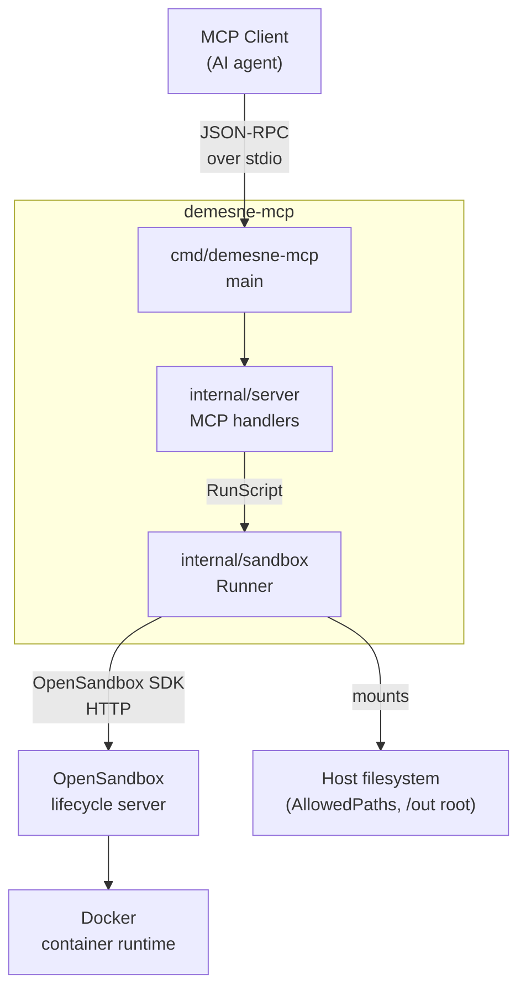
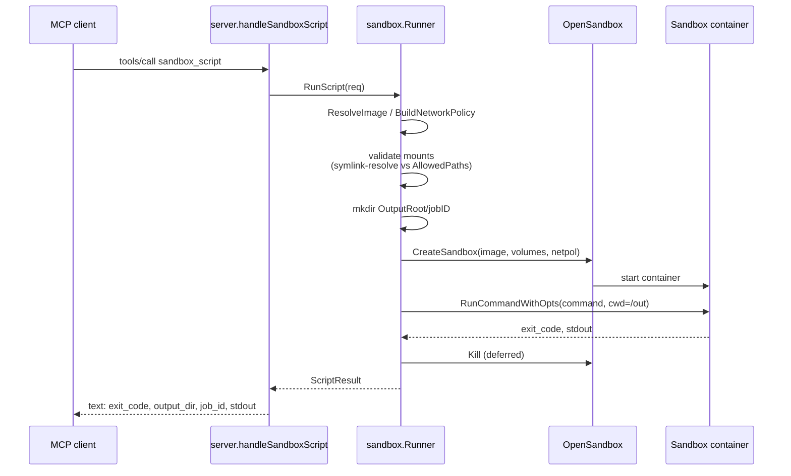

# Architecture

`cmd/demesne-mcp` loads configuration from the environment, builds a `sandbox.Runner`, and serves MCP over stdio. `internal/server` registers the `sandbox_script` tool and parses arguments, then delegates to the runner. `internal/sandbox` validates mounts, resolves images, builds the network policy, creates the sandbox via the OpenSandbox SDK, runs the command, and tears the sandbox down.

## Data flow

The deferred `Kill` runs against a fresh `context.Background()` with a 30-second timeout, so the sandbox is torn down even if the request context was cancelled. Commands run with `cwd=/out` and a 12-hour timeout so long-running data jobs aren't capped artificially.
