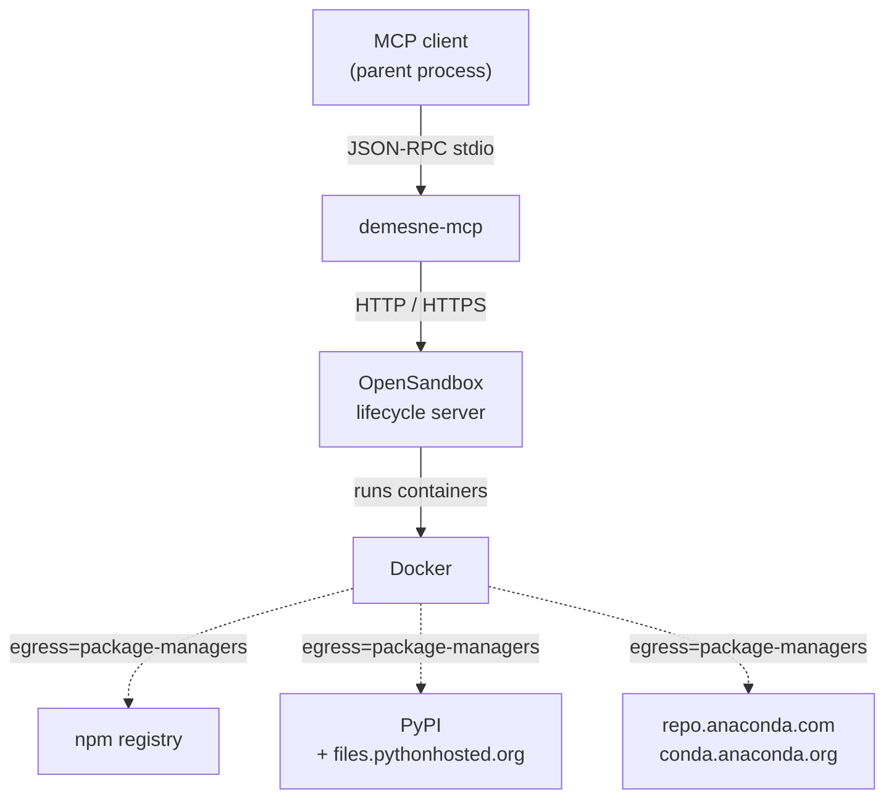

# Dependencies

External services in play:

- **MCP client (parent process)** — speaks JSON-RPC to demesne via stdin/stdout.
- **OpenSandbox lifecycle server** — HTTP/HTTPS, configured via `OPEN_SANDBOX_DOMAIN` / `OPEN_SANDBOX_PROTOCOL` / `OPEN_SANDBOX_API_KEY`.
- **Docker** — driven by OpenSandbox to run the container.
- **Package registries** (npm, PyPI, Anaconda) — only reachable from the sandbox when `egress=package-managers`.

Direct Go dependencies: [`github.com/mark3labs/mcp-go`](https://github.com/mark3labs/mcp-go) for the MCP framework, [`github.com/alibaba/OpenSandbox/sdks/sandbox/go`](https://github.com/alibaba/OpenSandbox) for the sandbox lifecycle SDK, and [`github.com/google/uuid`](https://github.com/google/uuid) for job IDs.
