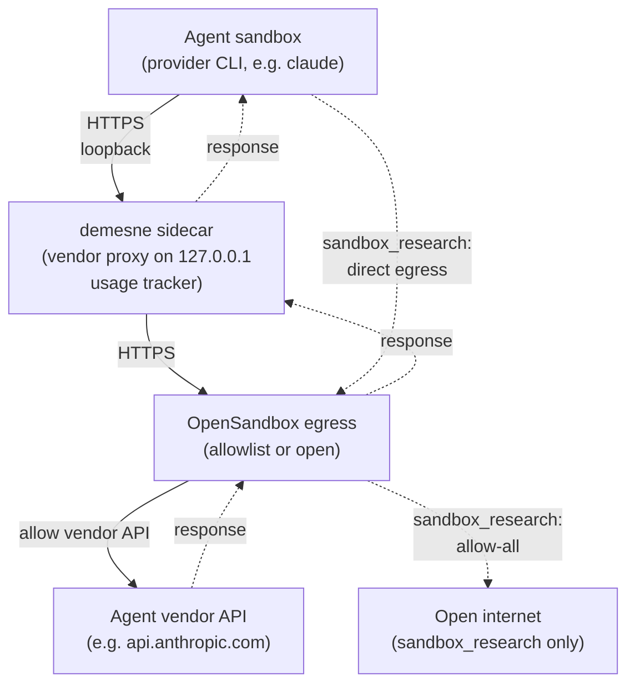
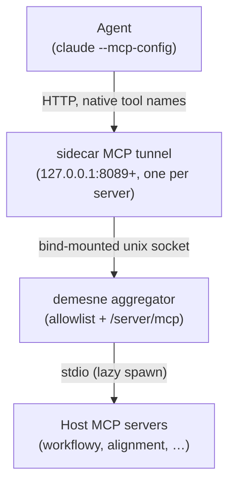
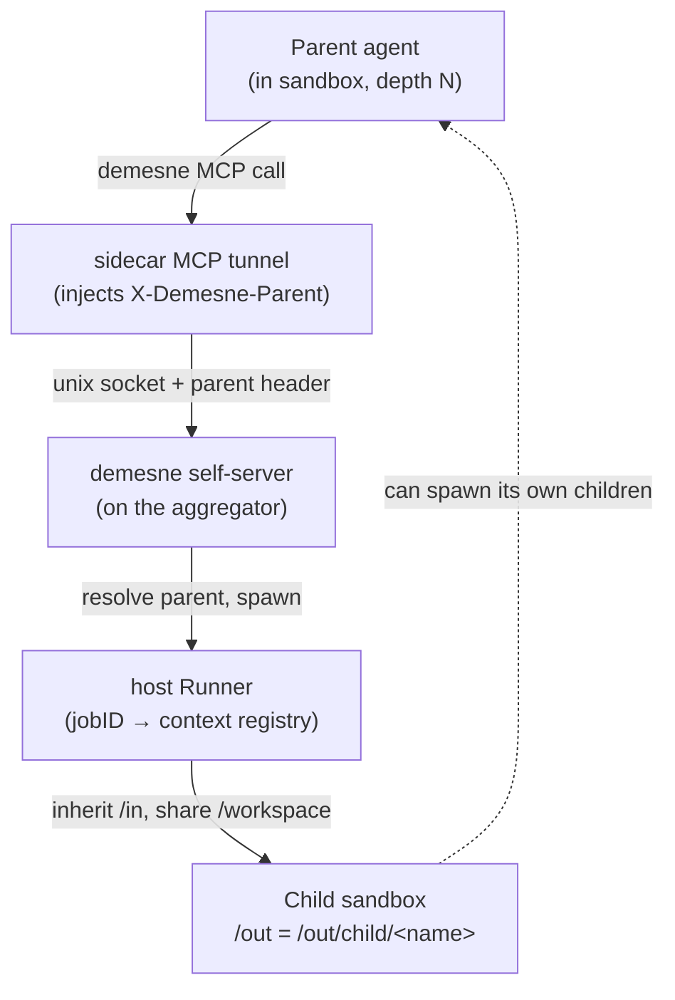

# Trust boundary, agents, and the per-sandbox sidecar

`sandbox_agent` and `sandbox_research` both run a registered AI
coding agent inside a fresh sandbox against a caller-supplied prompt.
Two providers are registered: **claude-code** (the Anthropic Claude
Code CLI), which authenticates with a long-lived `CLAUDE_CODE_OAUTH_TOKEN`
generated on the host via `claude setup-token`; and **codex**
(the OpenAI Codex CLI, **experimental**), which talks to the ChatGPT
Codex backend via a mirrored credential-holding proxy on loopback. Codex
uses ChatGPT-OAuth (not an API key): demesne reads the host's OAuth token
set from `DEMESNE_CODEX_AUTH_FILE` (default `~/.codex/auth.json`, written
by `codex login`); the proxy holds that token set off-agent, refreshes it
autonomously, and swaps in a fresh access token when forwarding — the
sandboxed Codex only ever sees a per-sandbox fake bearer. Additional providers slot in through the
`internal/agents/<vendor>` package layout.

`sandbox_agent` is the input-bearing variant: caller-supplied host
paths are mounted read-only at `/in/<basename>`, and egress is
restricted to the agent provider's API proxy (with `package-managers`
as an opt-in extra). `sandbox_research` is the open-egress variant:
no inputs, but the sandbox can reach anywhere on the open internet.
The combination of read-only inputs and open egress is the
data-exfiltration shape kept off the surface — `sandbox_agent`
refuses `egress: "open"`, and `sandbox_research` accepts no `files` /
`directories`.

For each invocation demesne starts a **per-sandbox sidecar container**
that joins OpenSandbox's egress-sidecar network namespace. The sidecar
runs exactly one vendor proxy — the one matching the agent vendor
(anthropic proxy on `127.0.0.1:8088` for claude-code; OpenAI proxy on
`127.0.0.1:8086` for codex); the agent reaches it on localhost. The proxy holds the real upstream OAuth token; the
agent only ever sees a per-sandbox fake token (`demesne-agent-...`)
that the proxy validates and swaps. The proxy parses the upstream API
response for token usage and writes a `usage.json` to the
sidecar-private results dir after every request (copied to `/out`
after the run). Tracking is read-only — the `cost_usd` figure is
indicative.

Inside the container the agent sees three mounts:

- **`/in`** — read-only inputs. For `sandbox_agent`, caller `files` /
  `directories` land here at `/in/<basename>`; `sandbox_research`
  never has any of those. A generated context file lives at
  `/in/<context-file>` — the filename comes from the agent provider
  (`CLAUDE.md` for claude-code) — describing the environment + task
  for the agent to read as project context.
- **`/workspace`** — writable scratch, also the agent's cwd. Use this
  for intermediate state.
- **`/out`** — writable. Anything written here (including the
  generated `usage.json`) is preserved on the host at the returned
  `output_dir` after the sandbox is torn down.

The agent run is one-shot. The sandbox is destroyed once the
provider's CLI exits; the `output_dir`, `workspace_dir`, generated
context file, and `usage.json` remain on the host.

## Host MCP tools

When host MCP servers are configured, the agent also reaches them
through the sidecar. At startup demesne's in-process **aggregator**
reads `~/.claude.json`, and for each stdio server with allowlisted
tools it serves an MCP-over-HTTP endpoint at `/<server>/mcp` on a
**unix socket** (upstream subprocesses spawn lazily on first use).
The runner bind-mounts that socket into each sandbox sidecar, which
runs one loopback HTTP listener per server forwarding over the
shared socket; the agent is pointed at the listeners with
`--mcp-config --strict-mcp-config`, so it sees each server under its
native tool names and nothing else. A unix socket (rather than a
host TCP port) is what makes this work under rootless podman, where
the sandbox network namespace can't reach a host-process port — a
bind-mounted socket is just a file and crosses the boundary
regardless.

Only allowlisted tools are exposed: the aggregator builds each
server's tool set from the read-only defaults (or the override
file) intersected with what the upstream advertises, so a
non-allowlisted tool never appears in `tools/list` and can't be
called. There is no auth between agent, tunnel, and aggregator — the
sandbox edge is the trust boundary. To change what's exposed, edit
`~/.config/demesne/mcp-allowlist.json` (per server: `"default"`,
`"*"`, an explicit list of tool names, or `[]` to disable) and
restart demesne.

## Child sandboxes

demesne re-exposes its *own* tools to the agent the same way: an
in-process `demesne` MCP server is mounted on the aggregator
alongside the discovered upstreams (via its `ExtraServers` hook), so
it rides the same socket + tunnel. The agent can spawn child
sandboxes — `sandbox_script` / `agent` / `research` / `create` /
`exec` / `destroy` (no `upload`/`download`) — none of which take
mount params. `sandbox_agent` children inherit the parent's read-only `/in` and
shared writable `/workspace`, and write to `/out/child/<name>`;
`sandbox_research` children instead get a fresh private workspace with no `/in` mounts;
grandchildren nest deeper, so the whole descendant tree materialises
under the root run's `/out`. Names are required and unique per parent.

The host process does the actual spawning (a sibling sandbox, not
podman-in-podman). Because the `demesne` server is per-caller while
external upstreams are context-free, the sidecar tunnel injects a
trusted `X-Demesne-Parent: <jobID>` header on the demesne binding
only — stripping any client-supplied value first, so the agent (which
reaches only the loopback listener) can't forge it. The runner keeps a
jobID → spawning-context registry it populates for every agent run;
the demesne handlers resolve the header against it. No auth is needed:
identity is structural, matching the sandbox-edge trust boundary.
There is no recursion depth cap.

Each agent run also writes `<out>/results.json` with `own_usage_usd`
and `total_usage_usd` (the latter sums every descendant's
`results.json`, so the root carries the whole tree's indicative cost).

## Getting an OAuth token (claude-code provider)

`claude setup-token` on the host generates a long-lived token tied to
your Anthropic account and prints it. Put it in
`DEMESNE_CLAUDE_CODE_OAUTH_TOKEN`. The sandbox's vendor proxy reads
it from its sidecar environment, validates inbound agent requests
against the per-sandbox fake token, and substitutes the real one
upstream — the agent container never sees the real token. Future
providers register their own OAuth env var alongside this one.
